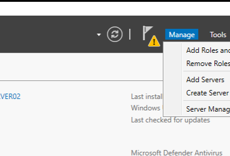

# Setup Active Directory on Windows Server 2022
# Active Directery 
Active Directory (AD) is a directory service developed by Microsoft for managing users, computers, and other resources in a network. Windows Server 2022 provides robust tools for deploying and managing AD.

# Installing Active Directory Domain Services (AD DS)

In the windoes server VM go to `Server Manager` --> Local Server 
on the right hand side clickon "manage" tab and "Add Roles and Features"

then following will pop up

click on next
Select "Role-based or feature-based installation" and next

select the server from server pull 
and next

# AD
to install active directery we will select "Active Directery Domain Services" and "DNS Server" for active directery and name server  
when the popup shows click add feature

after all the features selected click on install
it might take from few seconds to minute 

and close it.
when finished on the top righr corner yellow notification flag pop up 

to begain AD click on it and promote AD 

