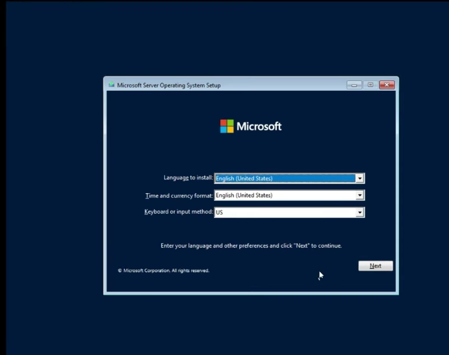

# set virtual server
Open Vm ware workstation clicl on new virtual  machine 

 Click on next 

# Select Operating System  
 here we selcet windows server
and for the 
"Version" select "WINDOWS SERVER 2022"

# Set up RAM and storage 
select 4 GB of ram and 60+ GB of storage 

# Os set up
go to Use " ISO image file " and browse the iso image file loaction and select the file

________________________

# Power on the Virtual Machine
After  power on we will get this page and click on next

# select os 
from the list we well select "Windows server Data center Evualation Desktop Edition" 
* I'm selecting this cause it gives us graphical user interface.

# storage and partision 
i'm keping my full 60Gb storage and in it will be my mail os and all apps .
if you want to seperate the storage drive click on "new" and select the size and finish .

click on next 

after setup boot screan will show

# set admin crediantials

in vm waer to go to login page click
ctrl + Alt + Ins

